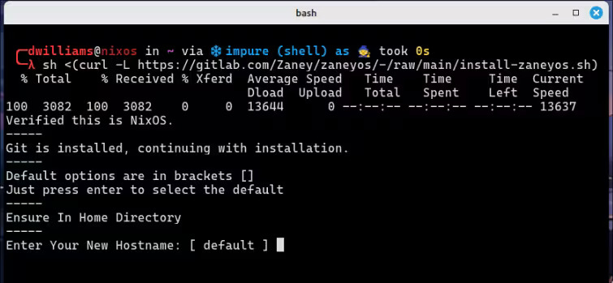

<div align="center">

## tanOS

tanOS is my fork of zaneyos that is becoming more divergent over time. This really only exists for me but it seems simpler to keep it public and be able to use the install script. 
[original project](https://gitlab.com/Zaney/zaneyos).


#### Requirements

- You must be running on NixOS, version 23.11+. 
- The `tanos` folder (this repo) is expected to be in your home directory.
- You must have installed NIXOS using **GPT** parition with booting with **UEFI**.
- ** 500MB minimum /boot parititon required. **
- Systemd-boot is all I use, I assume it could be modified to use grub, etc

## Installation: 

<details>
<summary><strong> ⬇️ Install with script </strong></summary>


### 📜 Script:

This will quickly get you setup with my config. 

Simply copy this and run it:

```
nix-shell -p git curl
```

Then:



```
sh <(curl -L https://raw.githubusercontent.com/crowquillx/tanosV3/refs/heads/main/install-tanos.sh)
```

#### After the install completes, reboot.

</details>

<details>
<summary><strong> 🦽 Manual install process:  </strong></summary>

1. Run this command to ensure Git & Vim are installed:

```
nix-shell -p git vim
```

2. Clone this repo & enter it:

```
cd && git clone https://github.com/crowquillx/tanosV3.git
cd tanos
```

- _You should stay in this folder for the rest of the install_

3. Create the host folder for your machine(s) like so:

```
cp -r hosts/default hosts/<your-desired-hostname>
```

4. Edit `hosts/<your-desired-hostname>/variables.nix`.

5. Edit `flake.nix` and fill in your username, profile, and hostname.

6. Generate your hardware.nix like so:

```
nixos-generate-config --show-hardware-config > hosts/<your-desired-hostname>/hardware.nix
```

7. Run this to enable flakes and install the flake replacing hostname with
   whatever you put as the hostname:

```
NIX_CONFIG="experimental-features = nix-command flakes" 
sudo nixos-rebuild switch --flake .#profile
```

Now when you want to rebuild the configuration you have access to an alias
called `fr` that will rebuild the flake and you do not have to be in the
`tanos` folder for it to work.

</details>


### Special Recognitions:
 These are the credits from the zaneyos repo at the time of forking, plus zaney himself.

- Tyler Kelley   https://gitlab.com/Zaney https://www.youtube.com/@ZaneyOG https://www.patreon.com/akazaney https://zaney.org/
- Jakookit  https://github.com/jakookit
- Justaguylinux   https://github.com/drewgrif
- Jerry Starke    https://github.com/JerrySM64